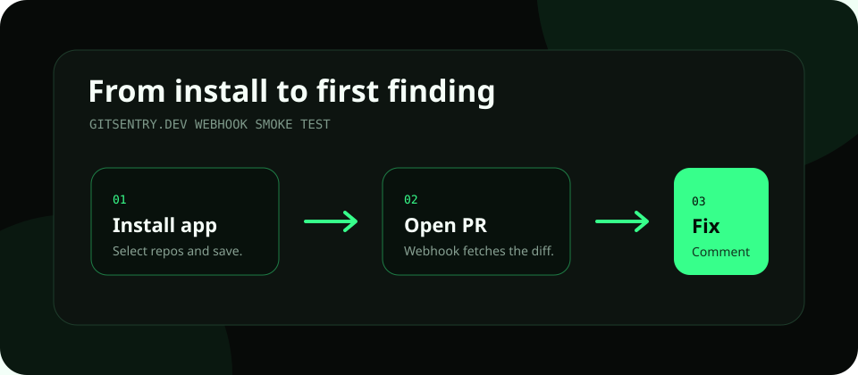

# Gitsentry.dev

> AI-powered security scanner for pull requests. Catches vulnerabilities in your code diff before it reaches production — and can block merges until findings are resolved.

**[MIT License](LICENSE)** · **[Install GitHub App](https://github.com/apps/gitsentry)**


---

## The Problem

Engineering teams ship code using AI tools (Cursor, Copilot, Claude Code, etc.) faster than they review it. AI models produce predictable security anti-patterns: missing auth checks, unvalidated inputs, hardcoded secrets, IDOR vulnerabilities. Existing scanners aren't trained on these specific failure modes.

## The Solution

Gitsentry.dev installs as a GitHub App. It listens to `pull_request` events — when a PR is opened, updated, or reopened — runs an AI security analysis on the full PR diff, and surfaces findings exactly where developers already work: **as GitHub PR review comments**.

```
PR opened / updated → webhook → AI analysis → GitHub review comment + check run posted
```

On Pro, the check run conclusion is set to `failure` when critical or high severity findings exist. Pair it with a GitHub branch protection rule and merges are blocked until the findings are resolved.

## Install

**[Install Gitsentry.dev on GitHub](https://github.com/apps/gitsentry)**

One click. No config required.



Gitsentry.dev is open-source security infrastructure you can run yourself. Use the hosted GitHub App, or self-host the webhook server, database, and dashboard for your own repos.

---

## What It Catches

| Category                                             | Example                                           |
| ---------------------------------------------------- | ------------------------------------------------- |
| `hardcoded_secret`                                   | API keys, tokens, passwords in source code        |
| `missing_auth`                                       | New routes with no authentication middleware      |
| `sql_injection`                                      | User input concatenated into SQL queries          |
| `idor`                                               | User-supplied IDs fetched without ownership check |
| `verbose_error`                                      | Stack traces / DB errors exposed to client        |
| `unvalidated_input`                                  | User input passed to dangerous operations         |
| `missing_rate_limit`                                 | Auth endpoints with no rate limiting              |
| `path_traversal`                                     | User input in file system operations              |
| `xss`                                                | Unsanitised user content in HTML responses        |
| `open_redirect`                                      | User-controlled redirect URLs                     |
| `csrf` / `weak_session_management`                   | Browser and session flow weaknesses               |
| `privilege_escalation` / `mass_assignment`           | Permission and object mutation abuse              |
| `race_condition` / `business_logic_abuse`            | Workflow and state manipulation bugs              |
| `cors_misconfiguration` / `security_headers_missing` | Deployment and browser boundary risks             |
| `dependency_risk`                                    | Vulnerable or suspicious dependency behavior      |
| `attack_chain`                                       | Multiple smaller issues combined into one exploit |

---

## Self-Hosting

### Prerequisites

- Node.js 20+
- A GitHub App (see setup below)
- Supabase project
- Redis (optional until queue processing is enabled)
- Google Gemini API key

### 1. Create a GitHub App

1. Go to **GitHub → Settings → Developer settings → GitHub Apps → New GitHub App**
2. Set the webhook URL to `https://your-domain.com/webhook`
3. Generate a webhook secret and a private key
4. Grant these permissions:
   - **Repository → Pull requests**: Read & write
   - **Repository → Contents**: Read
   - **Repository → Checks**: Read & write (required for check runs and merge blocking)
5. Subscribe to events: `Pull request`

### 2. Configure environment

```bash
cp apps/backend/.env.example apps/backend/.env
# Fill in your values
```

### 3. Run the database migrations

Run the SQL in `apps/backend/src/db/schema.sql` against your Supabase project.

### 4. Start the server

```bash
yarn install
yarn dev
```

### 5. Expose locally for testing

```bash
npx smee -u https://smee.io/your-channel -t http://localhost:3000/webhook
```

---

## Blocking merges on findings (Pro)

Gitsentry posts a **GitHub Check Run** named `Gitsentry Security Scan` on every PR scan. On a Pro plan, the check conclusion is set to `failure` when critical or high severity findings are present. You can require this check in your branch protection rules to prevent merging until findings are resolved.

**To enable merge blocking for a repository:**

1. Go to your repo → **Settings → Branches**
2. Edit (or create) the protection rule for your default branch (e.g. `main`)
3. Enable **"Require status checks to pass before merging"**
4. Search for and add **`Gitsentry Security Scan`** as a required check

> The check name appears in the search only after Gitsentry has run at least one scan on a PR in that repository.

On the free plan the check run is always `neutral` — findings are visible in the PR but merges are never blocked. Upgrade to Pro to enable blocking.

---

## Repository Structure

This repo is the **open-source scanner only** — a single Node package at the root (`yarn dev`, `yarn test`). Source lives under `apps/backend/`; `packages/scanner-contract/` defines public finding types and scanner constants.

```
apps/backend/src/           ← webhook server + AI engine
packages/scanner-contract/  ← public scanner types + constants
```

The app is designed to be self-hosted: configure your GitHub App, run the Supabase schema, start the backend, and point the dashboard at the same database.

---

## Contributing

Pull requests welcome. See [CONTRIBUTING.md](CONTRIBUTING.md).

---

## License

MIT — see [LICENSE](LICENSE).
